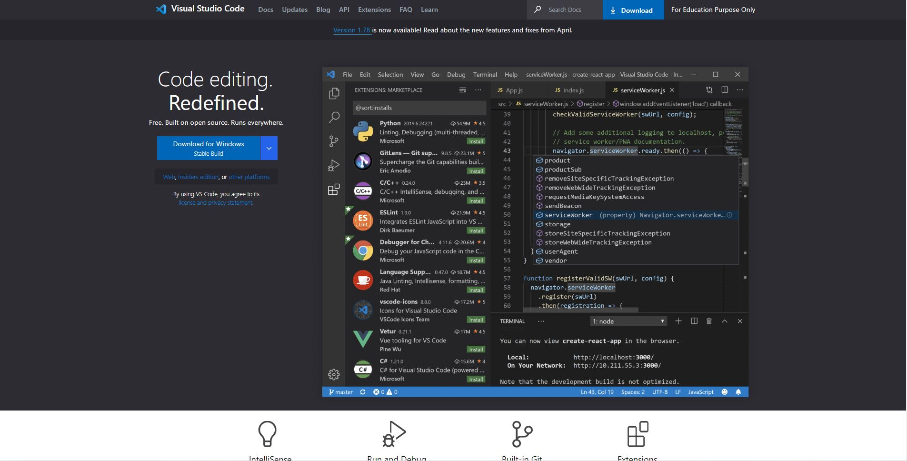

# Visual Studio Clone

This is a project using HTML and CSS. Mainly, we learned about CSS flexbox - row and col and **CSS positioning** to build a landing page. 

### 🔸 Learnings

 

## Deployed Link: [Click Here]()

###  🔸 The site works best on a 26-Inch monitor. It is not responsive.

 

## Tech Stacks
 

 

## Screenshots

 
