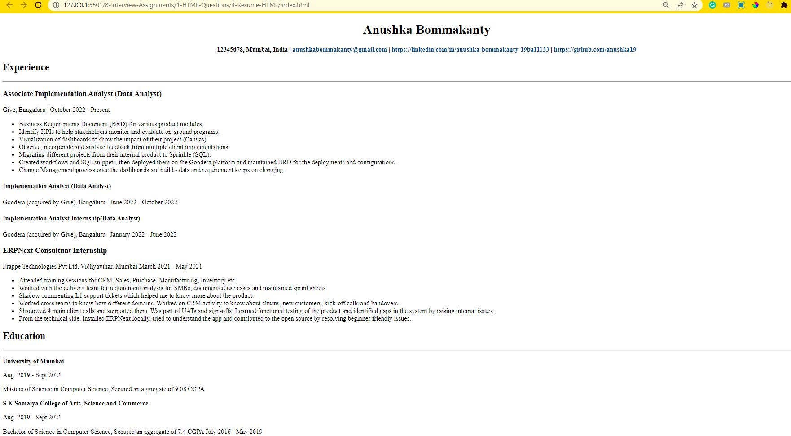

# Q4. Resume using HTML

This is a project using HTML. It's a simple resume using HTML

 

## Deployed Link: [Resume Link](https://resume-anushka19.netlify.app/)

 

## Tech Stacks
 

 

## Screenshots

 
