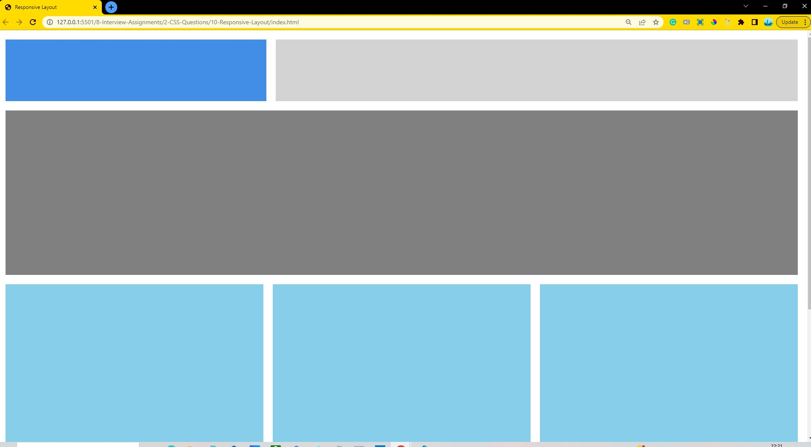
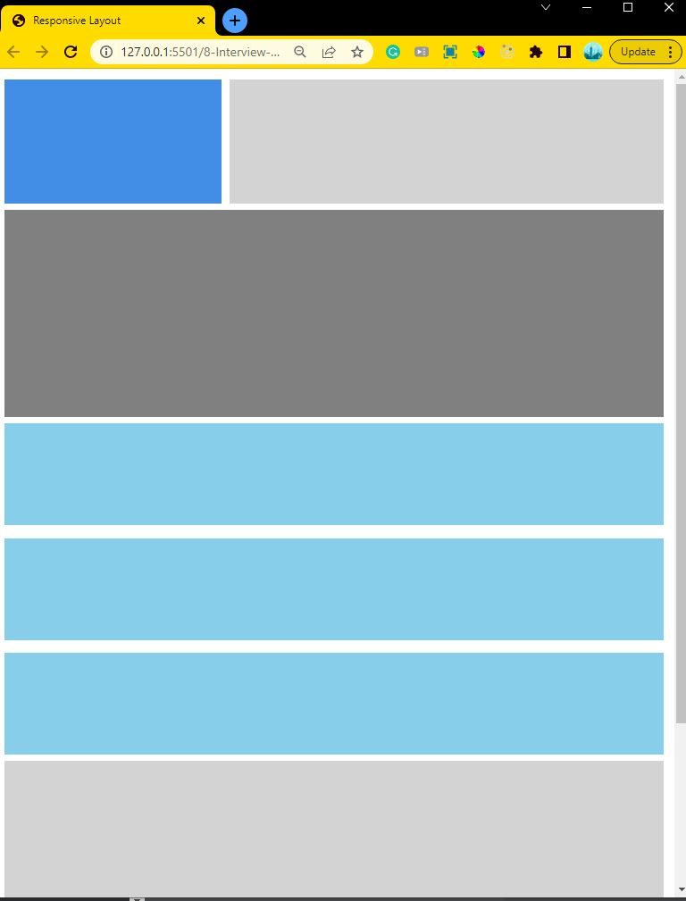

# Q10. Responsive Page

This is a project using HTML and CSS. We are using flexbox, positioning, css box model and media query to achieve it.

 

## Deployed Link: [Click Here](https://responsive-layout-css-anushka19.netlify.app/)

 

## Tech Stacks

 

## Screenshots

Bigger Screens

Smaller Screens

 
