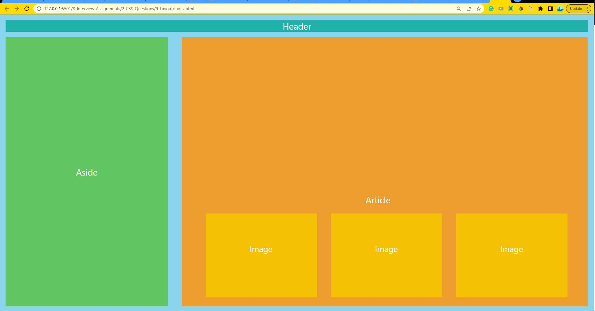

# Q9. Layout

This is a project using HTML and CSS. We are using flexbox, positioning and css box model to achieve it.

 

## Deployed Link: [Click Here](https://layout-anushka19.netlify.app/)

### 🔸 Site works best on 24-Inch monitor. Site is not responsive.

 

## Tech Stacks

 

## Screenshots

 
