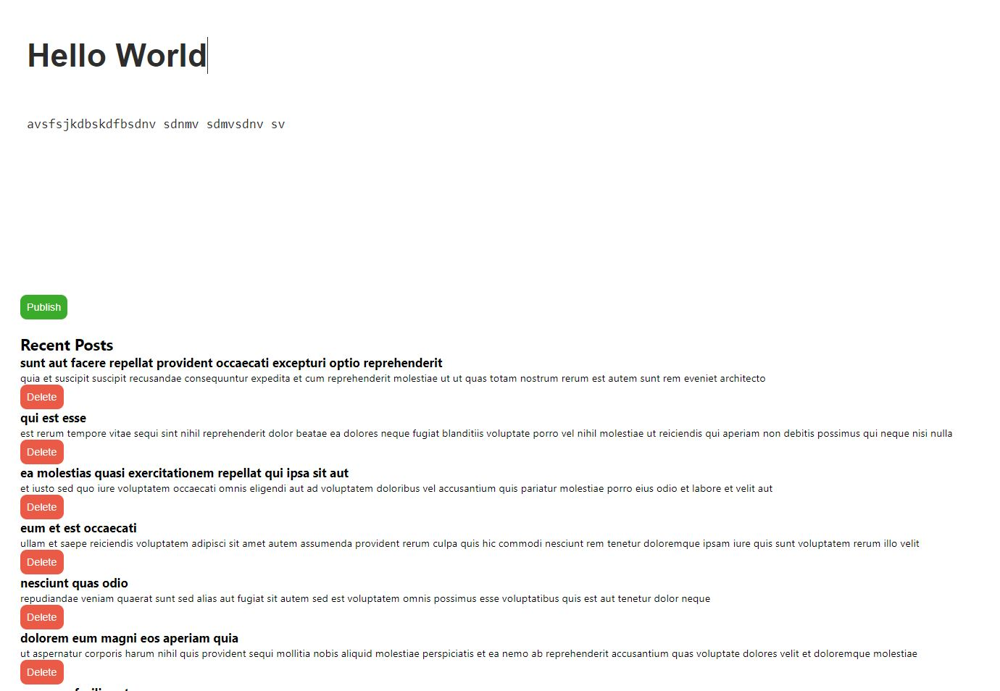

# Q12. Blogging Website

This is a project using Javascript. We are using to fetch data from [site](https://jsonplaceholder.typicode.com/posts) to get the initial list of posts. We are performing basic CRUD operations.

The fetch function is used to perform a GET request to the API, and the retrieved posts are displayed in the UI using the displayPosts function.

The createPost function is responsible for creating a new blog post. It retrieves the title and content input values, creates a new post object, and sends a POST request to the API using the fetch function. Upon successful creation, the created post is appended to the post list in the UI.

The deletePost function handles the deletion of a blog post. It sends a DELETE request to the API with the corresponding post ID, and upon successful deletion, it removes the post from the UI by removing its corresponding list item.

The displayPosts function loops through the posts array and creates list items for each post using the createPostListItem function. It appends these list items to the post list in the UI.

The createPostListItem function creates a list item element for a blog post. It sets the title and content based on the post data, adds a delete button, and attaches an event listener to handle the delete functionality.

Note: The delete functionality will only work in this example if the JSONPlaceholder API allows deletion.

 

## Deployed Link: [Click Here](https://blogging-app-js-anushka19.netlify.app/)

 

## Tech Stacks

 

## Screenshots

Bigger Screens

 
