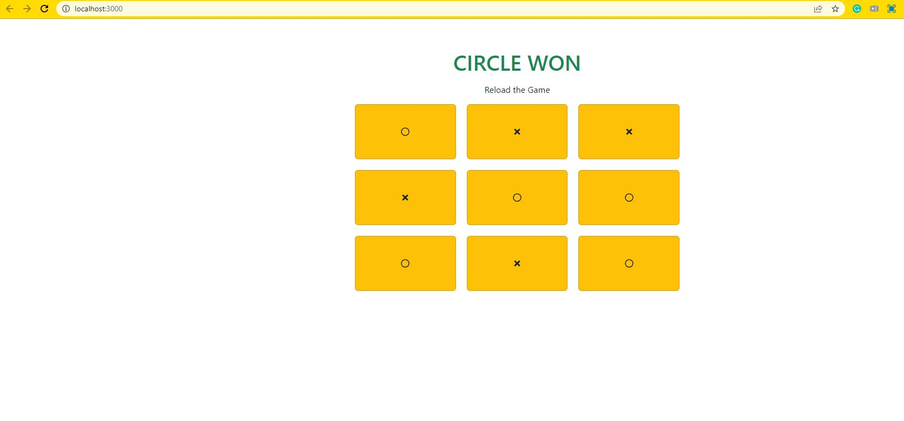

# Tic-Tac-Toe App

This project was bootstrapped with [Create React App](https://github.com/facebook/create-react-app).

This project is a web-based Tic Tac Toe game built using React JS class components. It allows users to play the classic game against each other. The game interface is created using React components and styled using Bootstrap and React-Icons.

Key features of the application include:

- `Game Logic`: The game follows the standard rules of Tic Tac Toe. Players take turns marking empty cells on a 3x3 grid, aiming to create a line of their respective symbols (X or O) horizontally, vertically, or diagonally. The game keeps track of the current player and determines the winner or a draw.

- `Interactive Interface`: The application provides an interactive user interface where players can click on empty cells to make their moves. The interface updates in real-time to show the current game state and display the symbols for each player.

- `Win Detection`: After each move, the application checks for a winning condition by examining the grid. If a player has formed a winning line, the game declares the winner and displays a win message. If the game ends in a draw, it shows a message indicating the draw.

- `Restarting the Game`: At the end of a game, players can restart by clicking the Reset button. This clears the board, resets the current player, and allows for a fresh gameplay.

- `Notifications`: The application uses toast messages from the react-toastify library to provide visual feedback. Toast messages notify players of game outcomes, such as a win or an attempt to make a move in an occupied cell.

Overall, this project demonstrates the implementation of a classic game using React JS class components, state management, and event handling. It offers an engaging user experience and showcases the capabilities of React JS for building interactive web applications.
In the project directory, you can run:

### `npm start`

Runs the app in the development mode.\
Open [http://localhost:3000](http://localhost:3000) to view it in your browser.

The page will reload when you make changes.\
You may also see any lint errors in the console.

## Deployed Link: [Tic Tac Toe]()

 

## Tech Stacks
 

 

## Screenshots

 

