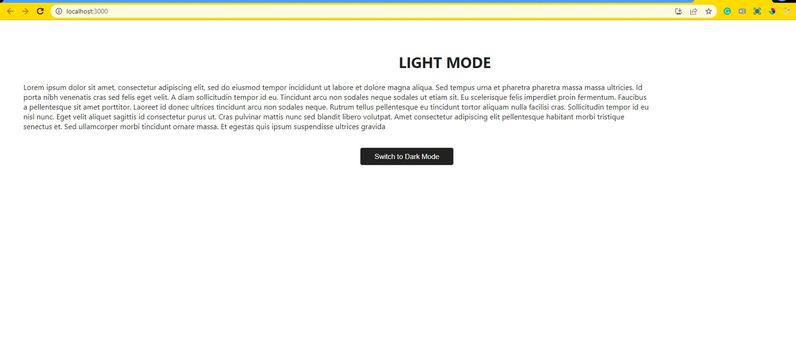
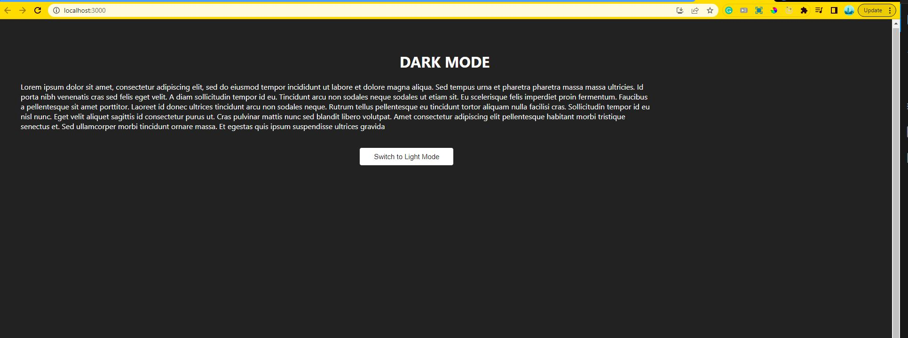

# Q9. Context API - Dark & Light Mode 

We used context api. We used reducers along with context api.

## Available Scripts

In the project directory, you can run:

### `npm start`

Runs the app in the development mode.\
Open [http://localhost:3000](http://localhost:3000) to view it in your browser.

The page will reload when you make changes.\
You may also see any lint errors in the console.

## Deployed Link: [Click Here]()

 

## Tech Stacks
 

 

## Screenshots

Light Mode:

Dark Mode:

 